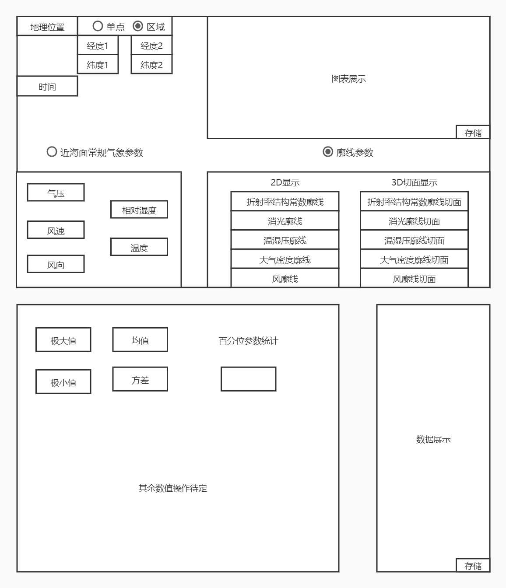

# 大气数据库软件项目开发文档

#### 设计目标

- 本产品要求能够根据用户提供的要求，读取后端提供的各类大气光学参数，在前端生成相应的图表；根据获得的数据，进行数值分析计算；最后需要能够存储数据文件以及图形文件。

####  设计思路

- 系统设计遵循“开放性框架结构+基础数据扩展填充”的基本思路。在设计、研制初期，以开放性软件框架设计为重点，确保系统能够正常运行，在系统运行、升级过程中，逐步增加基础数据，提供更多的基础性分析功能。

- 系统设计围绕业务流程而展开，按照业务流程需要，开发业务生成模块，然后根据业务生成模块功能需求，分解出软件的组件、数据库、物理模块等相对底层模块等。

#### 设计原则

- 系统应具有良好的可维护性、鲁棒性、互操作性、可扩展性、资源重复利用性。

- 数据管理应符合数据库设计基本原则。

- 系统布署应具有良好的平台适应性，不同版本间应具有良好兼容性。

#### 开发环境及工具

- vue2
- webpack
- vuex
- vue-router
- axios
- less

#### 需求概述

- 本软件的主体需求如下：
  - 运行软件
  - 能够选择连接数据库
  - 对查询按钮触发的事件能及时做出响应，将查询结果显示在界面表格中
  - 对不同的筛选条件能做出正确响应，做出正确查询
  - 对非法查询区间做出提示，实现友好的人机交互
  - 实现查询结果的可视化
  - 实现数值计算功能
  - 退出
- 初步分为六大模块，即地理位置选择模块、数值计算模块、常规气象参数选择模块，廓线参数选择模块、数据展示模块以及存储模块、GIS系统模块。其中有几点需要注意：
  - 部分数据规格较小，应当取对数转换数据再进行输出。
  - GIS系统模块暂时不需要制作。

    图1 海上大气光学软件展示

## 系统功能组成

- **地理位置选择模块**
  - 该模块需要满足地理位置选择需求，如果选择单点，则需要输入选择位置的经纬度，若需要显示廓线3D切面，则需要输入起始点的经纬度与终止点的经纬度，进行范围选择。当选中单点时，应只有经纬度1能够输入（经纬度2呈灰色），进行范围选择时，经纬度1、2均要求输入。且在选择单点输入时，不能选择显示相应3D切面，而在进行范围输出时，应只能够选择显示3D切面。
- **数值计算模块**
  - 对于某一选定参数，需要显示出相应的极大值、极小值、均值与方差，对于概率统计百分位数参数统计，需要在操作人员选择相对的百分位数（5%,…,95%）时输出不同概率。
- **近海面常规气象参数-图表展示模块**
  - 根据需求选择近海面常规气象参数温度、相对湿度、气压、风速、风向中的一种，数据库中的常规气象参数每5秒存储一次，时间可以选择任一年、任一月、任一日进行展示，若选择一年数据进行绘图展示，则应在相应数据库中选择每隔六小时输出一个数据，若选择一月数据进行绘图展示，则应在相应数据库中选择每隔一小时输出一个数据，若选择一日数据进行绘图展示，则应该相应数据库中选择每隔5秒钟输出一个数据。需要输出的图表大致如下，应有明确的横纵坐标。
- **廓线参数-2D显示模块**
  - 在某一固定点，Cn2廓线参数在不同高度随着时间变化形成的动图，由于Cn2数值太小，取对数显示数据
- **廓线参数-3D切面显示模块**
  - 该模块要求输出在某一时间段内，对应经纬度连成的区域范围内相应廓线参数的3D切面时间变化展示。
- **存储模块**
  - 对于每次不同操作生成的图表均需要可以进行存储。

## 后台数据格式

- 数据库目前选用SQL server，所有的数据保持统一的形式，时间格式按HH:MM:SS来存储。HH、MM、SS分别表示时分秒，均为2位数字(如：14:12:05)；